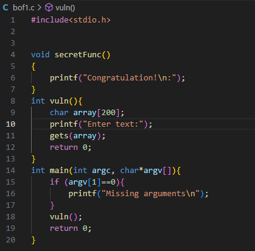
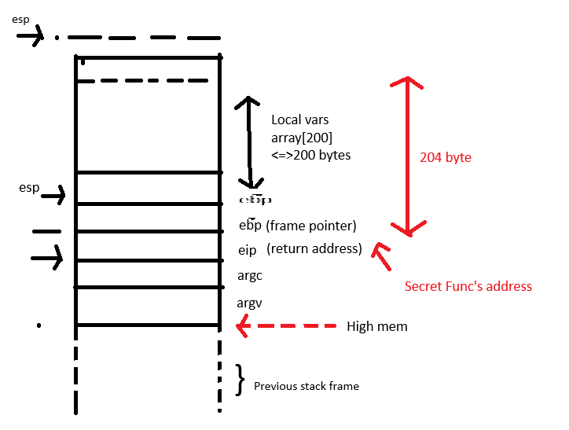
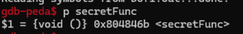
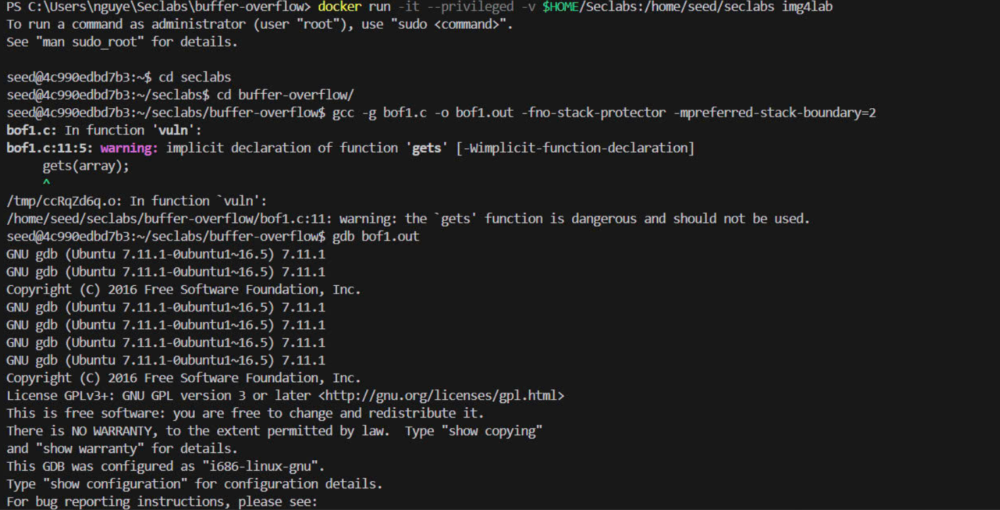
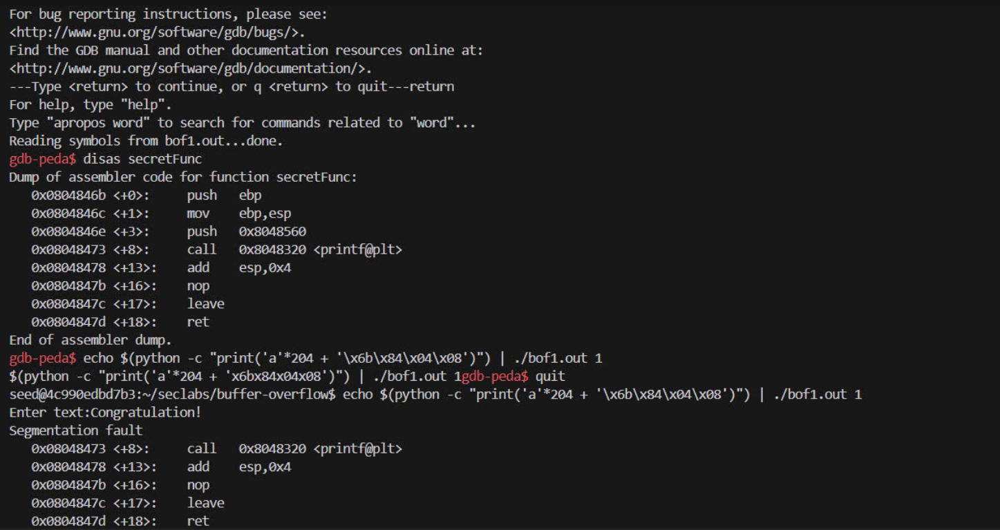
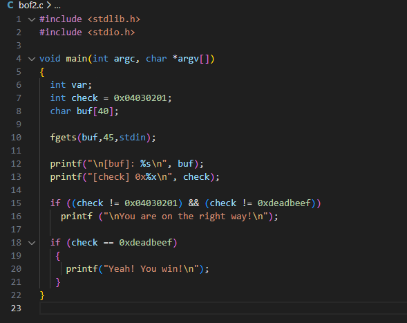
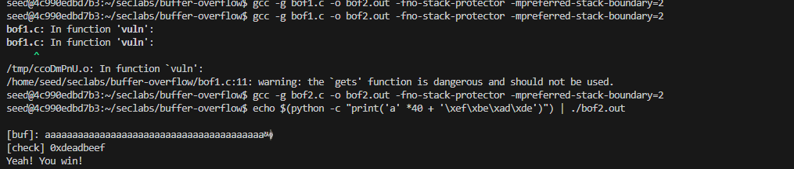
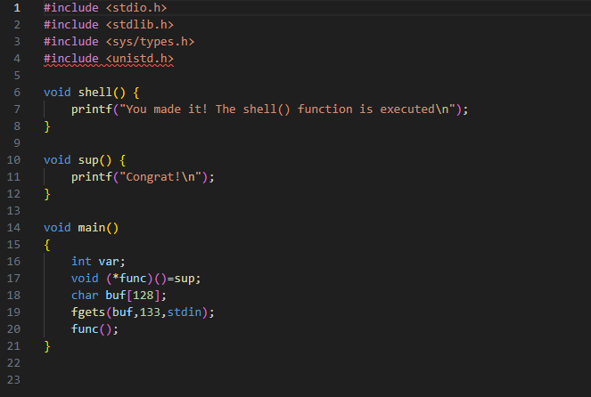
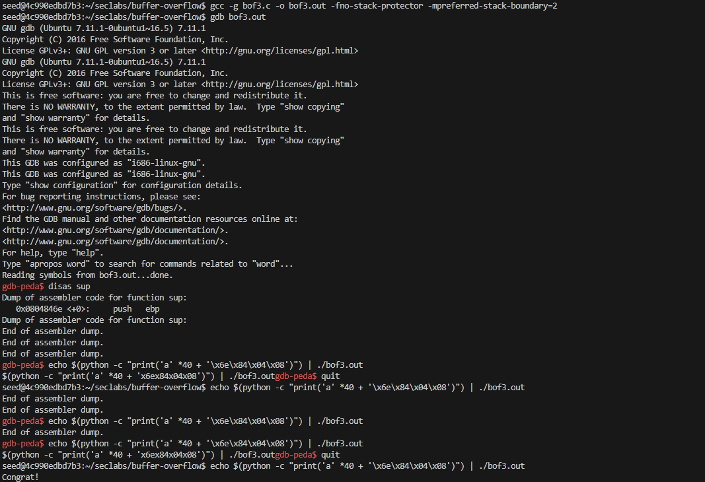

## Lab 1: Conduct buffer overflow attack on bof1.c, bof2.c, bof3.c programs.
### BOF1
##### 
Step 1: Open folder BUFFER-OVERFLOW
 
Step 2: Open bof1 have the code below:
 

 
- Command explaination:
   `gcc -w -g bof1.c -o bof1.out -fno-stack-protector -mpreferred-stack-boundary=2
` 

The provided code snippet compiles the C program bofl.c into an executable file named bofl.out using the GCC compiler. The command line options used are:

-w: Disables warning messages during compilation.
 
-g: Enables debugging information in the executable. 
-o bofl.out: Specifies the output file name as bofl.out. 
-fno-stack-protector: Disables stack protection, which is a security measure to prevent buffer overflow attacks. 
-mpreferred-stack-boundary=2: Sets the preferred stack alignment to 2 bytes. 
This code snippet will create a file named bofl.out in the same directory as the bofl.c file.

   

### Strategy of buffer overflow

The local vars section is the memory area allocated by the program to store declared variables. Make the memory overflow to the EIP register (Extended Instruction Pointer) [which is the address register of the next task to be performed] to point directly to the address of the function (or instruction) to be executed (in this case, secretFunc)

  -To debug the program using GDB, first, run the command:

  `gdb bof1.out` 
  Once inside GDB, use the command `info functions` to list all the functions in the program. Here, we are particularly interested in the function `secretFunc()`.  
  Next, use the command disas secretFunc to disassemble the function and find the addresses of the instructions within secretFunc.

To find the address of the `secretFunc` itself, use the command `p secretFunc`. This address is useful as it can be used to overwrite the EIP register, allowing you to hijack the program’s control flow and execute `secretFunc`. 

Here the  secretFunc is 0x80486b, then use "q" to quit gdb. 
To finish the lab by entering the command:  
`python -c "print('a' * 204 + '\x6b\x84\x04\x08')" | ./bof1.out`  
Which mean the result of the previous command will be the next input command. 

 

To cause a buffer overflow from the base pointer (ebp) register to the instruction pointer (eip) register, 204 bytes of data are needed.
The hexadecimal address 0x80486b will be represented in its raw byte form as `\x6b\x84\x04\x08`.

### BOF2
The bof2 code: 

#### gcc command:

`gcc -g bof1.c -o bof2.out -fno-stack-protector -mpreferred-stack-boundary=2`: This compiles the C program (`bof1.c`) into an executable (`bof2.out`). Let's break down the options:  
`-g`: Generates debugging information. 
`-fno-stack-protector`: Disables the compiler's stack protection (like canaries),  which prevents certain buffer overflow attacks. 
`-mpreferred-stack-boundary=2`: Aligns the stack to 2-byte boundaries, which can be useful for exploiting older architectures or simplifying the overflow.  

#### Execution of the program:

`echo $(python -c "print('a' * 40 + '\xef\xbe\xad\xde')") | ./bof2.out`
  This command runs the compiled program bof2.out and attempts to overflow the buf buffer in the program.
`python -c "print('a' * 40 + '\xef\xbe\xad\xde')"` 
 The Python command generates a string of 40 'a' characters followed by the byte sequence \xef\xbe\xad\xde, which represents the value 0xdeadbeef in little-endian format (this is the target value for the check variable). 
The `echo` command pipes this string as input into the program.

The byte sequence `\xef\xbe\xad\xde` overwrites check with the value `0xdeadbeef`.  
The program then checks the value of check, and since it matches `0xdeadbeef`, the "Yeah! You win!" message is printed.

### BOF3
The bofe code :  

 Compilation with Special Flags: 
  `gcc -g bof3.c -o bof3.out -fno-stack-protector -mpreferred-stack-boundary=2`
 

 Disassembling the sup() Function: 
 `gdb-peda$ disas sup`   

 Using GDB (specifically PEDA, an extension for GDB), we disassemble the `sup()` function to identify its memory address, which in this case is `0x0804846e`. This address will be used in the exploit to redirect program execution to `sup()`. 

  Crafting the Exploit: The goal of the exploit is to overflow the `buf` array, overwrite the func pointer, and redirect it to the `sup()` function.  

`echo $(python -c "print('a' * 40 + '\x6e\x84\x04\x08')") | ./bof3.out`  

This command generates the payload using a Python script:

- `'a' * 40`: Fills the buffer with 40 `'a'` characters. This ensures that we overwrite enough memory to reach the location of the `func` pointer. 
- `\x6e\x84\x04\x08`: This is the memory address of the `sup()` function in little-endian format (because of the system's architecture). We aim to overwrite func with this address. 
The crafted input is then piped into the vulnerable program (`bof3.out`). 

### Exploit Execution
After the buffer overflow occurs, the `func` pointer is overwritten with the address of the `sup()` function. When the program attempts to call `func()`, it executes `sup()` instead, printing `"Congrat!"` as a result.

